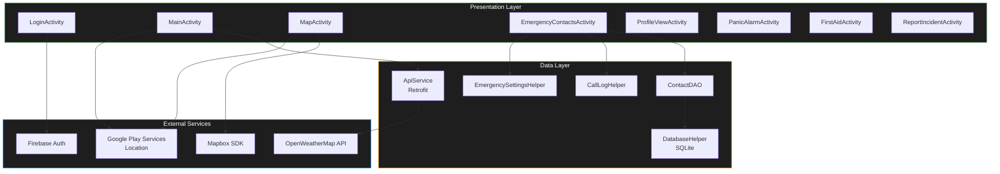

# 🛡️ TerraGuard

<div align="center">


**Your Personal Safety & Emergency Preparedness Companion**

[](https://developer.android.com/)
[](https://www.java.com/)
[](https://firebase.google.com/)
[](https://www.mapbox.com/)
[](LICENSE)
[](https://developer.android.com/)

[Features](#-features) • [Architecture](#-architecture) • [Installation](#-installation) • [Tech Stack](#-tech-stack) • [API Setup](#-api-setup) • [Contributing](#-contributing)

</div>

---

## 📖 About

**TerraGuard** is a comprehensive Android application designed to enhance personal safety and emergency preparedness. Built with modern Android development practices, it provides real-time environmental monitoring, emergency contact management, panic alarm functionality, first-aid guidance, and location-based services — all to help users stay informed, alert, and prepared for any situation.

> Whether you're tracking air quality, monitoring weather patterns, triggering a panic alarm, or accessing first-aid instructions — TerraGuard has you covered.

---

## ✨ Features

### 🌡️ Real-Time Weather Monitoring
- **Live Temperature** — Current temperature data based on GPS location
- **24-Hour Temperature Trend** — Interactive cubic-bezier line chart (MPAndroidChart) showing forecast in 3-hour intervals
- **Weather Conditions** — Real-time weather status from OpenWeatherMap API

### 🌬️ Air Quality Index (AQI)
- **Real-Time AQI Data** — Live air quality levels fetched for your exact location
- **Color-Coded Status** — Intuitive visual indicators (Good · Fair · Moderate · Poor · Very Poor)
- **Health Awareness** — Stay informed about outdoor activity safety

### 🗺️ Interactive Map
- **Mapbox SDK Integration** — Beautiful, responsive vector maps
- **Real-Time Location Tracking** — GPS-powered location display with custom markers
- **Weather Overlay** — See weather and AQI data directly on the map
- **Saved Locations** — Mark and save important locations

### 🚨 Panic Alarm
- **One-Tap Activation** — Instantly trigger a full emergency alarm
- **Multi-Sensory Alert** — Simultaneous loud siren (max volume), rapid flashlight strobe (300ms interval), and continuous vibration pattern
- **Auto-Recovery** — Alarm automatically stops on activity pause/destroy and restores original volume

### 🩹 First-Aid Guide
- **Offline Reference** — Step-by-step instructions for CPR, Choking (Heimlich Maneuver), Severe Bleeding, and Burns
- **Material Card Layout** — Clean, readable card-based design for quick scanning during emergencies
- **Safety Disclaimer** — Clear reminder to call emergency services first

### 📋 Incident Reporting
- **Structured Form** — Report incidents with type selection (Spinner), severity level (RadioGroup), and ambulance request (CheckBox)
- **Timestamped History** — All submitted reports appear in a scrollable log with automatic timestamps
- **Quick Reset** — Form auto-resets after submission for rapid successive reports

### 📞 Emergency Contacts
- **Quick Dial** — One-tap calling for emergency contacts
- **Predefined Numbers** — Built-in Police, Fire Department, and Ambulance entries
- **Custom Contacts** — Add personal emergency contacts with name and number
- **Contact Import** — Import contacts directly from your phone's contact list
- **Call Log Access** — View recent calls for quick re-dial
- **RecyclerView UI** — Smooth scrolling list with call and delete actions

### 👤 User Profile & Preparedness
- **Safety Score** — Track your emergency preparedness level with a circular progress indicator
- **Preparedness Checklist** — Emergency kit, offline maps, emergency plan tracking
- **Medical Information** — Store blood type and allergies (shared only in SOS mode)
- **Achievements** — Gamified badges for completing safety tasks
- **Statistics** — View drills completed and alerts received

### 🔐 Secure Authentication
- **Google Sign-In** — Quick and secure authentication via Firebase Auth
- **Email/Password Login** — Traditional login option with form validation
- **Session Management** — Automatic session persistence and easy sign-out

---

## 🏗️ Architecture



---

## 🛠️ Tech Stack

| Category | Technology | Version |
|----------|------------|---------|
| **Language** | Java | 8+ |
| **Platform** | Android | Min SDK 24 · Target SDK 35 |
| **Build System** | Gradle (Kotlin DSL) | — |
| **UI Framework** | Material Design 3 · ConstraintLayout · CardView | — |
| **Authentication** | Firebase Auth · Google Sign-In | BOM-managed |
| **Maps** | Mapbox Maps SDK | 10.16.0 |
| **Weather API** | OpenWeatherMap | Free Tier |
| **Charts** | MPAndroidChart | 3.1.0 |
| **Networking** | Retrofit 2 + Gson Converter | 2.9.0 |
| **Location** | Google Play Services Location | 21.0.1 |
| **Database** | SQLite (local storage via `DatabaseHelper`) | — |

---

## 📦 Installation

### Prerequisites

| Requirement | Minimum |
|-------------|---------|
| Android Studio | Arctic Fox or later |
| Android SDK | API 24+ |
| Java | JDK 8+ |
| Git | Latest |

### 1. Clone the Repository

```bash
git clone https://github.com/animeshD06/TeraGaurd.git
cd TeraGaurd
```

### 2. Configure API Keys

> ⚠️ **Important**: Never commit API keys to version control. The `.gitignore` is already configured to exclude sensitive files.

#### OpenWeatherMap API Key
1. Sign up at [OpenWeatherMap](https://openweathermap.org/api) (free tier)
2. Generate an API key
3. Update the key in `app/src/main/java/com/example/teragaurd/MainActivity.java`:
   ```java
   private static final String API_KEY = "YOUR_OPENWEATHERMAP_API_KEY";
   ```

#### Mapbox Access Token
1. Sign up at [Mapbox](https://www.mapbox.com/)
2. Get your **public** access token
3. Add it to `app/src/main/res/values/strings.xml`:
   ```xml
   <string name="mapbox_access_token">YOUR_MAPBOX_PUBLIC_TOKEN</string>
   ```

#### Mapbox Downloads Token (for SDK dependency resolution)
1. Generate a **secret** token in your Mapbox account with `Downloads:Read` scope
2. Add it to `gradle.properties` (project root):
   ```properties
   MAPBOX_DOWNLOADS_TOKEN=YOUR_MAPBOX_SECRET_TOKEN
   ```

#### Firebase Configuration
1. Create a project in [Firebase Console](https://console.firebase.google.com/)
2. Add an Android app with package name `com.example.teragaurd`
3. Enable **Google Sign-In** under Authentication → Sign-in method
4. Download `google-services.json` and place it in the `app/` directory
5. Add your app's **SHA-1** fingerprint in Firebase project settings

### 3. Build & Run

```bash
# Open the project in Android Studio
# Sync Gradle files (File → Sync Project with Gradle Files)
# Select a device/emulator (API 24+)
# Click Run ▶️
```

---

## 🔑 API Endpoints Used

### OpenWeatherMap (Free Tier)

| Endpoint | Purpose | Used In |
|----------|---------|---------|
| `/weather` | Current weather data (temperature) | `MainActivity` |
| `/air_pollution` | Air Quality Index | `MainActivity` |
| `/forecast` | 5-day / 3-hour forecast (8 entries = 24 hrs) | `MainActivity` |

### Mapbox
- Vector map rendering with custom styling
- Real-time location tracking and marker placement

### Firebase
- Google Sign-In authentication flow
- User session persistence and management

---

## 📁 Project Structure

```
app/src/main/
├── java/com/example/teragaurd/
│   │
│   ├── ── Activities ──────────────────────────────
│   ├── LoginActivity.java              # Authentication (Google + Email/Password)
│   ├── MainActivity.java               # Home dashboard (Weather, AQI, Chart, Quick Actions)
│   ├── MapActivity.java                # Interactive Mapbox map with location tracking
│   ├── EmergencyContactsActivity.java  # Contact management (CRUD, import, call log)
│   ├── profile_view_Activity.java      # User profile, safety score, achievements
│   ├── PanicAlarmActivity.java         # Panic alarm (siren + flash + vibration)
│   ├── FirstAidActivity.java           # First-aid reference guide (CPR, burns, etc.)
│   ├── ReportIncidentActivity.java     # Incident reporting form with history
│   │
│   ├── ── Adapters ────────────────────────────────
│   ├── EmergencyContactsAdapter.java   # RecyclerView adapter for contact list
│   │
│   ├── ── Data Models ─────────────────────────────
│   ├── WeatherResponse.java            # Weather API response model
│   ├── AqiResponse.java                # AQI API response model
│   ├── ForecastResponse.java           # Forecast API response model
│   ├── EmergencyContact.java           # Contact data model
│   │
│   ├── ── Data Access ─────────────────────────────
│   ├── ApiService.java                 # Retrofit API interface definitions
│   ├── DatabaseHelper.java             # SQLite database creation & versioning
│   ├── ContactDAO.java                 # CRUD operations for emergency contacts
│   │
│   └── ── Utilities ───────────────────────────────
│       ├── CallLogHelper.java          # System call log content provider access
│       └── EmergencySettingsHelper.java # System settings (flashlight, volume, vibration)
│
└── res/
    ├── layout/                          # 8 activity layouts + 2 component layouts
    ├── drawable/                         # Custom shapes, gradients, and vector icons
    ├── menu/                            # Bottom navigation menu
    ├── values/                          # Strings, colors, themes
    ├── values-night/                    # Dark theme overrides
    ├── mipmap-*/                        # App launcher icons (all densities)
    └── xml/                             # Backup rules, data extraction rules
```

---

## 🎨 Design Philosophy

TerraGuard follows modern Android design principles with a focus on usability during emergencies:

| Principle | Implementation |
|-----------|----------------|
| **Dark Theme** | Eye-friendly dark UI (`#121212` / `#1E1E1E`) with carefully chosen accent colors |
| **Material Design 3** | MaterialCardView, MaterialButton, BottomNavigationView |
| **Edge-to-Edge** | Full edge-to-edge display with proper system bar insets |
| **Color-Coded Information** | AQI status colors, severity indicators, alarm state colors |
| **Smooth Animations** | Chart entry animations, cubic-bezier line interpolation |
| **Accessibility** | Content descriptions on all interactive elements, readable text sizes |
| **Flat View Hierarchy** | ConstraintLayout for optimized rendering performance |

---

## 🔒 Permissions

| Permission | Usage | Required |
|------------|-------|----------|
| `INTERNET` | API calls, Firebase authentication | ✅ |
| `ACCESS_FINE_LOCATION` | GPS for weather, AQI, and map | ✅ |
| `ACCESS_COARSE_LOCATION` | Approximate location fallback | ✅ |
| `CALL_PHONE` | Emergency contact dialing | ✅ |
| `READ_CONTACTS` | Import contacts from phone | ✅ |
| `READ_CALL_LOG` | Display recent calls | ✅ |
| `CAMERA` | Flashlight strobe (panic alarm) | Optional |
| `VIBRATE` | Haptic alert notifications | Optional |

> **Hardware features** (camera, camera flash, telephony) are declared as `android:required="false"` — the app functions on devices without these features.

---

## 🚀 Future Roadmap

- [ ] **Offline Mode** — Cached weather data for areas with poor connectivity
- [ ] **Push Notifications** — Proactive weather and disaster alerts via Firebase Cloud Messaging
- [ ] **SOS Mode** — One-tap emergency broadcast with live location sharing to contacts
- [ ] **Family Sharing** — Real-time location sharing with trusted family members
- [ ] **Disaster Alerts** — Integration with government emergency alert systems (NDMA/NOAA)
- [ ] **Widget Support** — Home screen widget for at-a-glance weather and AQI
- [ ] **Multi-Language** — Localization support for broader accessibility
- [ ] **Cloud Sync** — Firebase Firestore for cross-device contact and preference sync

---

## 🤝 Contributing

Contributions are welcome! Please follow these steps:

1. **Fork** the repository
2. **Create** a feature branch
   ```bash
   git checkout -b feature/AmazingFeature
   ```
3. **Commit** your changes
   ```bash
   git commit -m "feat: add AmazingFeature"
   ```
4. **Push** to the branch
   ```bash
   git push origin feature/AmazingFeature
   ```
5. **Open** a Pull Request

### Commit Convention

| Prefix | Usage |
|--------|-------|
| `feat:` | New feature |
| `fix:` | Bug fix |
| `docs:` | Documentation only |
| `refactor:` | Code restructuring |
| `style:` | Formatting, no logic change |
| `test:` | Adding tests |

---

## 📄 License

This project is licensed under the **MIT License** — see the [LICENSE](LICENSE) file for details.

```
Copyright (c) 2026 Animesh Dubey
```

---

## 👨‍💻 Author

**Animesh Dubey**

[](https://github.com/animeshD06)

---

## 🙏 Acknowledgments

- [OpenWeatherMap](https://openweathermap.org/) — Weather & AQI data
- [Mapbox](https://www.mapbox.com/) — Map services & SDK
- [Firebase](https://firebase.google.com/) — Authentication & backend services
- [MPAndroidChart](https://github.com/PhilJay/MPAndroidChart) — Chart visualization library
- [Material Design](https://material.io/) — UI design system & components
- [Retrofit](https://square.github.io/retrofit/) — Type-safe HTTP client

---

<div align="center">

**Made with ❤️ for a safer world**

⭐ Star this repo if you find it useful!

</div>
